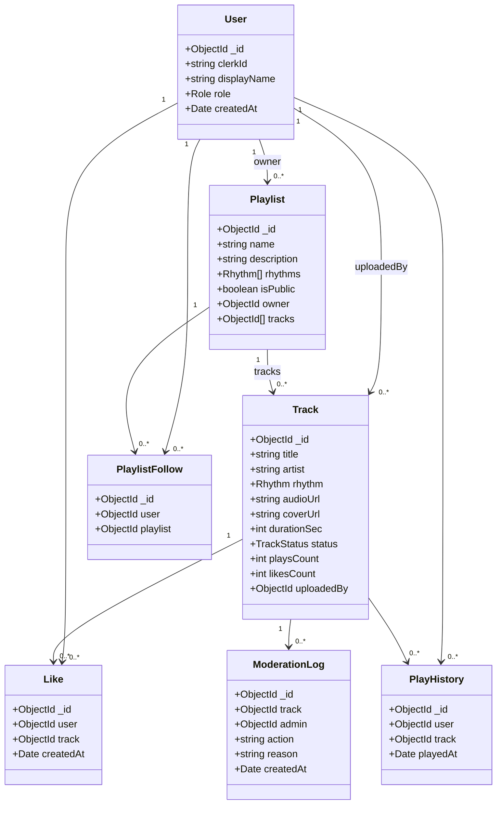

# Botecofy — Planejamento Técnico

> Plataforma de streaming musical interativa com **curadoria focada em ritmos de bar** (brega, pagode, sertanejo e arrocha).
> Documento de planejamento técnico do Trabalho Prático de **Engenharia de Software II**, organizado em **3 sprints**.

---

## Sumário

1. [Identificação da equipe e papéis](#1-identificação-da-equipe-e-papéis)
2. [Tema e problema que o sistema resolve](#2-tema-e-problema-que-o-sistema-resolve)
3. [Visão geral do produto](#3-visão-geral-do-produto)
4. [Atores e perfis de usuário](#4-atores-e-perfis-de-usuário)
5. [Funcionalidades principais](#5-funcionalidades-principais)
6. [Histórias de usuário e critérios de aceitação](#6-histórias-de-usuário-e-critérios-de-aceitação)
7. [Regras de negócio](#7-regras-de-negócio)
8. [Backlog priorizado](#8-backlog-priorizado)
9. [Decisão e justificativa arquitetural](#9-decisão-e-justificativa-arquitetural)
10. [Justificativa do framework e das tecnologias](#10-justificativa-do-framework-e-das-tecnologias)
11. [Modelo de domínio e entidades](#11-modelo-de-domínio-e-entidades)
12. [Modelo de dados (MongoDB / Mongoose)](#12-modelo-de-dados-mongodb--mongoose)
13. [Estrutura de pastas do projeto](#13-estrutura-de-pastas-do-projeto)
14. [Princípios de projeto, SOLID e padrões de projeto](#14-princípios-de-projeto-solid-e-padrões-de-projeto)
15. [Lacunas de plataforma de áudio preenchidas](#15-lacunas-de-plataforma-de-áudio-preenchidas)
16. [Planejamento das 3 sprints](#16-planejamento-das-3-sprints)
17. [Artefatos Scrum e quadro de acompanhamento](#17-artefatos-scrum-e-quadro-de-acompanhamento)
18. [Estratégia de testes e evidências](#18-estratégia-de-testes-e-evidências)
19. [Versionamento e convenção de commits](#19-versionamento-e-convenção-de-commits)
20. [Riscos, limitações e melhorias futuras](#20-riscos-limitações-e-melhorias-futuras)

---

## 1. Identificação da equipe e papéis

**Equipe: Os Botequeiros**

| Papel | Responsabilidade | Integrante |
|---|---|---|
| **Product Owner (PO)** | Visão do produto, priorização do backlog, valor das histórias | Maria Luiza Nascimento Morais |
| **Scrum Master** | Organização das sprints, impedimentos, condução das reuniões | Alvaro Miguel |
| **Time de Desenvolvimento** | Análise, projeto, codificação, testes, entrega do incremento | Maria Luiza Nascimento Morais, Alvaro Miguel, Isaac, Mourão |

> Todos os integrantes atuam no time de desenvolvimento (análise, projeto, código e testes). Maria Luiza acumula o papel de PO e Alvaro o de Scrum Master, conforme previsto no edital.

---

## 2. Tema e problema que o sistema resolve

**Tema:** plataforma de streaming musical com curadoria especializada em **ritmos de bar/boteco brasileiros**.

**Problema:** as grandes plataformas de streaming tratam brega, pagode, sertanejo e arrocha como gêneros secundários, com recomendação genérica e sem curadoria humana especializada. Quem quer montar a trilha sonora de um boteco, de uma festa ou de um momento de descontração precisa garimpar faixas dispersas.

**Solução do Botecofy:** um acervo organizado **por ritmo**, alimentado e **curado por curadores humanos** em playlists temáticas (ex.: "Pagode de Mesa de Bar", "Arrocha Sofrência", "Sertanejo Raiz"), com player próprio e descoberta orientada a ritmo. A interação social (curtidas e contador de execuções) é atualizada em tempo real para dar sensação de comunidade viva.

---

## 3. Visão geral do produto

> **Para** ouvintes e curadores de música de boteco
> **que** não encontram curadoria especializada em brega, pagode, sertanejo e arrocha,
> **o Botecofy** é uma plataforma de streaming musical
> **que** organiza o acervo por ritmo e oferece playlists temáticas curadas por pessoas, com player próprio e interação em tempo real.
> **Diferente de** plataformas genéricas de streaming,
> **o nosso produto** coloca a curadoria por ritmo de bar no centro da experiência.

---

## 4. Atores e perfis de usuário

| Perfil | Descrição | Principais ações |
|---|---|---|
| **Ouvinte** | Usuário autenticado que consome o acervo | Buscar/filtrar por ritmo, reproduzir, montar fila, curtir, seguir playlists |
| **Curador** | Usuário que alimenta e organiza o acervo | Cadastrar/editar faixas, criar/gerenciar playlists temáticas |
| **Administrador** | Responsável pela qualidade e moderação | Moderar faixas (inativar), gerenciar ritmos, gerir papéis |

> Autenticação e identidade são delegadas ao **Clerk**. O perfil/`role` é mantido no nosso banco e sincronizado pelo `clerkId`. Por padrão, um novo usuário entra como **Ouvinte**; a promoção a Curador/Administrador é feita pelo Administrador.

---

## 5. Funcionalidades principais

O edital exige no mínimo 3 funcionalidades principais. O Botecofy entrega **5**:

| Nº | Funcionalidade | Descrição | Perfis |
|---|---|---|---|
| 1 | **Gerenciar acervo musical** | Cadastrar, editar, consultar e inativar faixas com metadados e arquivo de áudio, classificadas por ritmo | Curador, Admin |
| 2 | **Curadoria por ritmo** | Criar e gerenciar playlists temáticas associadas a um ou mais ritmos | Curador |
| 3 | **Descoberta e reprodução** | Buscar/filtrar o acervo por ritmo e reproduzir com player (fila, controle de estado, seek) | Ouvinte |
| 4 | **Interação social em tempo real** | Curtir faixas e ver contadores de plays/curtidas atualizados ao vivo (Socket.io) | Ouvinte |
| 5 | **Moderação do acervo** | Inativar faixas, gerenciar ritmos e papéis de usuário | Admin |

---

## 6. Histórias de usuário e critérios de aceitação

> Mínimo do edital: 5 histórias. O Botecofy define **8 histórias** distribuídas nas 3 sprints.

### HU01 — Cadastrar faixa no acervo
**Como** curador, **quero** cadastrar uma faixa com metadados (título, artista, ritmo, capa) e arquivo de áudio, **para** disponibilizá-la no acervo.

**Critérios de aceitação:**
- Deve exigir título, artista, ritmo e arquivo de áudio.
- O ritmo deve ser um dos válidos (brega, pagode, sertanejo, arrocha).
- Não deve permitir título duplicado para o mesmo artista entre faixas ativas.
- O arquivo deve estar em formato suportado (mp3/aac) e dentro do limite de tamanho.
- A faixa deve iniciar com status **ativa**.
- Apenas Curador/Admin podem cadastrar (Ouvinte recebe 403).

### HU02 — Buscar e filtrar por ritmo
**Como** ouvinte, **quero** buscar e filtrar o acervo por ritmo e por texto, **para** encontrar músicas do meu estilo.

**Critérios de aceitação:**
- Deve listar apenas faixas **ativas**.
- Deve permitir filtrar por um ou mais ritmos.
- Deve permitir busca textual por título/artista.
- Deve permitir ordenação (mais recentes, mais tocadas, mais curtidas).
- Deve paginar resultados.

### HU03 — Reproduzir e controlar o player
**Como** ouvinte, **quero** reproduzir faixas e controlar o player (play/pause, próxima/anterior, volume, fila), **para** ouvir de forma contínua.

**Critérios de aceitação:**
- Deve tocar a faixa selecionada e permitir play/pause.
- Deve permitir avançar/voltar dentro de uma fila.
- Deve permitir ajustar volume e arrastar a posição (seek).
- Deve permitir adicionar faixas à fila.
- O contador de execuções (plays) deve incrementar somente após reprodução mínima (anti-inflação).

### HU04 — Criar e gerenciar playlists temáticas
**Como** curador, **quero** criar e gerenciar playlists associadas a ritmos, **para** organizar a curadoria.

**Critérios de aceitação:**
- Deve exigir nome e ao menos um ritmo.
- Não deve permitir nome de playlist duplicado para o mesmo curador.
- Deve permitir adicionar/remover/reordenar faixas (apenas faixas ativas).
- Deve permitir marcar como pública ou privada.
- Apenas o dono (ou Admin) pode editar/excluir.

### HU05 — Curtir faixa com atualização em tempo real
**Como** ouvinte, **quero** curtir uma faixa e ver curtidas/plays atualizando ao vivo, **para** interagir com o acervo.

**Critérios de aceitação:**
- Um ouvinte só pode curtir a mesma faixa uma vez (toggle curtir/descurtir).
- O contador de curtidas deve atualizar em tempo real para todos os clientes conectados (Socket.io).
- O contador de plays deve atualizar em tempo real.
- A ação exige autenticação.

### HU06 — Seguir playlist e montar fila
**Como** ouvinte, **quero** seguir playlists públicas e montar minha fila a partir delas, **para** personalizar a experiência.

**Critérios de aceitação:**
- Deve permitir seguir/deixar de seguir playlists públicas.
- Deve listar as playlists seguidas no perfil.
- Deve permitir carregar uma playlist inteira na fila do player.
- Playlists privadas não devem aparecer para quem não é o dono.

### HU07 — Moderar acervo
**Como** administrador, **quero** inativar faixas e gerenciar ritmos, **para** manter a qualidade da curadoria.

**Critérios de aceitação:**
- Deve permitir inativar/reativar faixas com justificativa.
- Faixa inativa não aparece em buscas nem pode ser adicionada a playlists.
- Deve permitir consultar o histórico de moderação.
- Apenas Admin tem acesso (demais perfis recebem 403).

### HU08 — Perfil sincronizado e histórico
**Como** ouvinte autenticado, **quero** ter meu perfil sincronizado (Clerk) com meus dados e histórico, **para** retomar de onde parei.

**Critérios de aceitação:**
- No primeiro login, o usuário é provisionado no banco a partir do `clerkId`.
- Deve registrar o histórico das últimas faixas tocadas.
- Deve exibir curtidas e playlists seguidas.
- Sessões não autenticadas não acessam o perfil.

---

## 7. Regras de negócio

| ID | Regra | História(s) |
|---|---|---|
| RN01 | O ritmo de uma faixa/playlist deve pertencer ao conjunto válido: brega, pagode, sertanejo, arrocha | HU01, HU04 |
| RN02 | Não pode haver título duplicado para o mesmo artista entre faixas **ativas** | HU01 |
| RN03 | Somente Curador/Admin cadastram ou editam faixas; somente Curador (dono)/Admin editam playlists | HU01, HU04 |
| RN04 | Faixa nasce **ativa**; só Admin inativa; faixa inativa some das buscas e não entra em playlists | HU01, HU07 |
| RN05 | Playlist exige nome único por curador e ao menos um ritmo associado | HU04 |
| RN06 | Play só é contabilizado após **≥ 20s** de reprodução (anti-inflação de métricas) | HU03, HU05 |
| RN07 | Cada ouvinte curte uma faixa no máximo uma vez (operação idempotente / toggle) | HU05 |
| RN08 | Arquivo de áudio deve ser `mp3`/`aac` e ter no máximo **15 MB** | HU01 |
| RN09 | Playlist privada é visível apenas ao dono; pública é visível a todos | HU04, HU06 |
| RN10 | Provisionamento de usuário ocorre no primeiro acesso autenticado, a partir do `clerkId` | HU08 |

> As regras de negócio vivem na **camada de serviço (domínio)**, nunca nos controllers nem na interface — atendendo ao requisito de "regras de negócio fora da camada de interface".

---

## 8. Backlog priorizado

Prioridade: **MoSCoW** (Must / Should / Could). Estimativa em **Story Points** (escala de Fibonacci), confirmada via Planning Poker na Sprint correspondente.

| # | História | Prioridade | SP (estimado) | Sprint |
|---|---|---|---|---|
| HU01 | Cadastrar faixa no acervo | Must | 5 | 1 → 2 |
| HU02 | Buscar e filtrar por ritmo | Must | 3 | 1 → 2 |
| HU03 | Reproduzir e controlar player | Must | 8 | 2 |
| HU04 | Criar/gerenciar playlists | Must | 5 | 2 |
| HU05 | Curtir em tempo real | Should | 5 | 3 |
| HU06 | Seguir playlist e montar fila | Should | 3 | 3 |
| HU07 | Moderar acervo | Should | 3 | 3 |
| HU08 | Perfil sincronizado e histórico | Could | 3 | 3 |

> "1 → 2" indica história iniciada de forma mínima na Sprint 1 (base do sistema) e completada na Sprint 2.

---

## 9. Decisão e justificativa arquitetural

**Arquitetura escolhida:** **Arquitetura em Camadas (Layered Architecture)** no back-end, com front-end desacoplado consumindo a API REST + WebSocket. É uma das arquiteturas explicitamente aceitas pelo edital e é compatível com o porte do projeto.

**Por que camadas (e não hexagonal/clean completa):** o projeto é pequeno e a equipe precisa demonstrar separação de responsabilidades de forma clara, sem o custo de abstração de uma Clean Architecture completa. Camadas entregam a separação **apresentação → aplicação/domínio → persistência** com baixo atrito, e ainda assim permitem aplicar Repository, Service Layer, DTO e DIP de forma identificável.

### Camadas do back-end

```
HTTP / WebSocket  ─▶  Routes/Controllers  ─▶  Services (regras de negócio)  ─▶  Repositories  ─▶  MongoDB
                         (apresentação)          (aplicação/domínio)          (persistência)
                              │                         │
                            DTOs  ◀────────────────── Domain Models (Mongoose)
```

- **Apresentação** (`routes`, `controllers`, `sockets`, `middlewares`): recebe requisições, valida entrada, autentica (Clerk), traduz erros. **Não** contém regra de negócio.
- **Aplicação/Domínio** (`services`, `domain`): concentra as regras de negócio (RN01–RN10), orquestra repositórios e estratégias. Depende de **interfaces** de repositório, não de implementações.
- **Persistência** (`repositories`, `models`): isola o acesso a dados via Mongoose por trás de interfaces (padrão Repository).
- **Transversal** (`config`, `errors`, `dtos`, `lib`): configuração, tratamento de erros, contratos de dados, utilidades.

### Visão de implantação

```
[ Client React/Vite ]  ──REST (HTTP)──▶  [ API Express ]  ──Mongoose──▶  [ MongoDB ]
        │                                     │
        └────────── WebSocket (Socket.io) ────┘
        Clerk (front)  ◀── verificação de sessão/JWT ──▶  Clerk middleware (back)
   Arquivos de áudio: upload via API → StorageService (disco local no MVP, abstraído p/ nuvem)
```

---

## 10. Justificativa do framework e das tecnologias

| Camada | Tecnologia | Por que | Recursos usados |
|---|---|---|---|
| Front-end | **React + Vite + TypeScript + Tailwind** | Vite dá HMR rápido e build enxuto; TS garante contratos tipados ponta-a-ponta; Tailwind acelera UI consistente | Componentes, hooks, rotas, store de player |
| Estado (front) | **Zustand** (player) + **TanStack Query** (server state) | Separa **estado do player** (client) de **estado do servidor** (cache/sync). Preenche a lacuna de gestão de estado do player | Store com máquina de estados do player; cache/invalidações da API |
| Back-end | **Node.js + Express** | Framework minimalista e maduro; middlewares compõem bem com camadas; integração direta com Clerk e Socket.io | Rotas, controllers, middlewares, injeção de dependência manual |
| Banco | **MongoDB + Mongoose** | Modelo orientado a documentos casa com faixas/playlists (metadados flexíveis, arrays de faixas); Mongoose dá schema, validação e hooks | Schemas, validações, índices, populate |
| Autenticação | **Clerk** | Tira identidade/segurança do escopo do trabalho, com SDK pronto para React e middleware para Express | `<ClerkProvider>`, `requireAuth`, sincronização por `clerkId` |
| Tempo real | **Socket.io** | Atualização ao vivo de curtidas/plays; comunicação evento-baseada (padrão Observer) | Namespaces/rooms, eventos `track:liked`, `track:played` |
| Upload/áudio | **Multer** + streaming com **HTTP Range** | Upload multipart e reprodução com *seek* eficiente | `multer` no upload; `Accept-Ranges`/`206 Partial Content` na entrega |
| Testes | **Vitest** + **Supertest** | Test runner rápido alinhado ao ecossistema Vite/TS; Supertest para testes de API | Unitários de serviço; integração de endpoints |

**Limitações conhecidas das escolhas:** Mongoose não tem transações multi-documento triviais sem replica set; o armazenamento de áudio em disco local não escala (mitigado pela abstração `StorageService`); Socket.io adiciona estado de conexão a gerenciar.

---

## 11. Modelo de domínio e entidades



**Enumerações de domínio**
- `Role`: `listener` | `curator` | `admin`
- `Rhythm`: `brega` | `pagode` | `sertanejo` | `arrocha`
- `TrackStatus`: `active` | `inactive`

---

## 12. Modelo de dados (MongoDB / Mongoose)

| Coleção | Campos principais | Índices | Observações |
|---|---|---|---|
| `users` | `clerkId` (único), `displayName`, `role`, `createdAt` | `clerkId` único | Provisionado no 1º login (RN10) |
| `tracks` | `title`, `artist`, `rhythm`, `audioUrl`, `coverUrl`, `durationSec`, `status`, `playsCount`, `likesCount`, `uploadedBy` | `(artist, title)` único parcial p/ status `active` (RN02); `rhythm`; texto em `title`/`artist` | Contadores desnormalizados p/ tempo real |
| `playlists` | `name`, `description`, `rhythms[]`, `isPublic`, `owner`, `tracks[]` | `(owner, name)` único (RN05) | `tracks` é array ordenado de refs |
| `likes` | `user`, `track`, `createdAt` | `(user, track)` único (RN07) | Toggle idempotente |
| `playhistory` | `user`, `track`, `playedAt` | `(user, playedAt desc)` | Alimenta histórico (HU08) |
| `playlistfollows` | `user`, `playlist` | `(user, playlist)` único | Seguir/deixar de seguir (HU06) |
| `moderationlogs` | `track`, `admin`, `action`, `reason`, `createdAt` | `track` | Histórico de moderação (HU07) |

> O **script/instruções de criação da base** (índices e dados de exemplo/seed) será entregue como parte dos artefatos de implementação.

---

## 13. Estrutura de pastas do projeto

Monorepo com `client/` e `server/`:

```
botecofy/
├── docs/                         # planejamento, relatórios, evidências
├── client/                       # React + Vite + TS + Tailwind
│   └── src/
│       ├── app/                  # rotas, providers (Clerk, Query)
│       ├── components/           # UI reutilizável
│       ├── features/             # acervo, player, playlists, perfil
│       ├── store/                # Zustand (máquina de estados do player)
│       ├── lib/                  # api client, socket client
│       └── types/                # contratos compartilhados (DTOs)
└── server/                       # Node + Express
    └── src/
        ├── config/               # env, db, clerk, socket
        ├── routes/               # definição de endpoints (apresentação)
        ├── controllers/          # orquestra request→service→response
        ├── middlewares/          # auth (Clerk), role guard, error handler, upload
        ├── services/             # regras de negócio (domínio/aplicação)
        │   └── strategies/       # estratégias de ordenação/curadoria (Strategy)
        ├── repositories/         # acesso a dados (Repository) + interfaces
        ├── models/               # schemas Mongoose (entidades de domínio)
        ├── dtos/                 # contratos de entrada/saída
        ├── sockets/              # handlers de eventos em tempo real (Observer)
        ├── errors/               # exceções de domínio + tratamento central
        └── lib/                  # storage, utilidades
```

> A estrutura evita "toda a lógica numa classe/controller/função única": cada pasta tem finalidade clara (apresentação, aplicação, domínio, persistência, validação, erro, configuração).

---

## 14. Princípios de projeto, SOLID e padrões de projeto

### 14.1 Princípios de projeto (Seção 11 do edital)

- **Integridade conceitual:** nomes, rotas e fluxos seguem a mesma lógica (`/tracks`, `/playlists`, `TrackService`, `PlaylistService`); ritmo é sempre o mesmo enum em todas as camadas.
- **Ocultamento de informação:** controllers não conhecem Mongoose; serviços não conhecem `req`/`res`; o acesso a dados fica escondido atrás de interfaces de repositório.
- **Coesão:** `TrackService` cuida só de regras de faixa; `StorageService` só de arquivos; `LikeService` só de curtidas.
- **Acoplamento:** serviços dependem de **interfaces** (`ITrackRepository`), não de implementações concretas.
- **Separação de responsabilidades:** entrada (controllers), regra (services), persistência (repositories), validação (dtos/middlewares), erro (errors), configuração (config).

### 14.2 Princípios SOLID (mínimo 3 — aplicaremos os 5)

| Princípio | Onde aparece no código |
|---|---|
| **SRP** | Separação controller / service / repository / dto / model — cada classe tem uma razão para mudar |
| **OCP** | `SortStrategy` (mais recentes/tocadas/curtidas): adicionar nova ordenação não altera o `TrackService` |
| **LSP** | `BaseRepository<T>` com repositórios concretos substituíveis sem quebrar o serviço |
| **ISP** | Interfaces específicas (`ITrackRepository`, `IPlaylistRepository`) em vez de uma interface "gorda" |
| **DIP** | Serviços recebem repositórios e `StorageService` por **injeção** via abstração, não instanciam o concreto |

### 14.3 Padrões de projeto (mínimo 1 — aplicaremos vários, todos justificados)

| Padrão | Problema que resolve | Onde |
|---|---|---|
| **Repository** | Isolar o acesso a dados do Mongoose, permitindo testar serviços sem banco | `repositories/` |
| **Service Layer** | Concentrar regras de negócio fora de controllers e da UI | `services/` |
| **DTO** | Separar o dado da API do modelo interno de domínio (não vazar `_id`/campos internos) | `dtos/` |
| **Strategy** | Trocar a forma de ordenar/curar resultados sem mexer no serviço (OCP) | `services/strategies/` |
| **Factory Method** | Criar `Track` a partir de fontes diferentes (upload de arquivo vs. URL externa) | `services/track-factory` |
| **Observer** | Notificar clientes de mudanças (curtida/play) em tempo real via Socket.io | `sockets/` |
| **State** | Máquina de estados do player no front (`idle → loading → playing → paused`) e ciclo da faixa (`active/inactive`) | `client/src/store` + `Track.status` |

> O relatório final apontará **as classes/métodos/pacotes exatos** onde cada princípio e padrão foi aplicado, evitando uso "apenas nominal".

---

## 15. Lacunas de plataforma de áudio preenchidas

O edital não detalha fluxos específicos de áudio; estas decisões técnicas preenchem essas lacunas:

1. **Gestão de estado do player:** máquina de estados no front (Zustand) com estados explícitos `idle → loading → playing → paused → ended`, fila (`queue`), índice atual e volume. Padrão **State**.
2. **Upload de arquivos:** upload multipart via **Multer**, validado por tipo/tamanho (RN08), persistido por um `StorageService` abstrato (disco local no MVP; trocável por nuvem via DIP).
3. **Streaming/seek:** entrega de áudio com **HTTP Range Requests** (`Accept-Ranges: bytes`, resposta `206 Partial Content`) para permitir arrastar a posição sem baixar o arquivo inteiro.
4. **Contagem de plays honesta:** `play` só conta após ≥ 20s de reprodução (RN06), evitando inflar métricas.
5. **Tempo real:** contadores de plays/curtidas desnormalizados em `tracks` e propagados a todos os clientes via eventos Socket.io (**Observer**).

---

## 16. Planejamento das 3 sprints

> Cada sprint gera um **incremento verificável** e o conjunto de artefatos exigido pelo edital. Apresentações: **04, 11 e 18 de junho**.

### 🟢 Sprint 1 — Análise, planejamento técnico e base arquitetural
**Período:** semana do dia **28 de maio**.
**Objetivo:** compreender o problema, definir escopo, planejar o backlog e preparar a estrutura inicial do projeto.

**Atividades obrigatórias**
- [x] Definir o tema do sistema (curadoria por ritmo de bar)
- [x] Definir a visão geral do produto
- [x] Identificar usuários/perfis/atores (Ouvinte, Curador, Admin)
- [x] Elaborar as histórias de usuário (HU01–HU08)
- [x] Escrever critérios de aceitação para cada história
- [x] Definir as funcionalidades principais (5)
- [x] Priorizar o backlog (MoSCoW + SP)
- [x] Planejar quais histórias entram em cada sprint
- [x] Escolher linguagem, framework e arquitetura
- [x] Justificar a escolha tecnológica
- [ ] Criar o repositório do projeto (Git)
- [ ] Criar a estrutura inicial do código (monorepo client/server)
- [ ] Configurar o framework escolhido (Express + Vite + Clerk + Socket.io + Mongoose)
- [x] Definir o modelo de dados inicial
- [ ] Implementar uma primeira versão mínima da base do sistema (provisionamento de usuário + cadastro/listagem mínima de faixa)

**Entregáveis da Sprint 1** (conforme edital)
- ✅ Documento com visão do produto → seções 2–3
- ✅ Backlog do produto → seção 8
- ✅ Critérios de aceitação → seção 6
- ✅ Planejamento das 3 sprints → seção 16
- ✅ Justificativa da arquitetura e do framework → seções 9–10
- ✅ Diagrama/modelo simples das principais entidades → seção 11
- ⬜ Repositório inicial com estrutura do projeto → seção 13 (a criar)
- ⬜ Repositório Git e projeto Trello

---

### 🟡 Sprint 2 — Projeto detalhado e implementação das funcionalidades centrais
**Período:** semana do dia **4 de junho**.
**Objetivo:** implementar as funcionalidades mais importantes aplicando princípios de projeto, SOLID, padrões e separação de responsabilidades.

**Histórias da sprint:** HU01 (completa), HU02, HU03, HU04.

**Atividades obrigatórias**
- Detalhar regras de negócio das histórias priorizadas (RN01–RN09)
- Aplicar **Planning Poker** em todas as histórias da Sprint (documentado)
- Revisar o modelo de domínio
- Implementar as funcionalidades (acervo, busca/filtro, player+fila, playlists)
- Implementar persistência de dados (Mongoose + repositórios)
- Aplicar separação entre camadas/módulos
- Aplicar princípios SOLID de forma identificável
- Aplicar padrão de projeto apresentável (Repository + Service Layer + Strategy + DTO)
- Criar documentos que comprovam validação/testes dos critérios de aceitação e regras de negócio

**Entregáveis da Sprint 2** (conforme edital)
- Incremento funcional do sistema
- Código versionado
- Documentação do Planning Poker de todas as histórias da Sprint
- Documentação das regras de negócio implementadas
- Explicação de onde e como os princípios SOLID foram aplicados (seção 14.2)
- Explicação do padrão de projeto utilizado (seção 14.3)
- Evidências de testes
- Atualização do backlog com situação das histórias

---

### 🔵 Sprint 3 — Finalização, qualidade, testes e apresentação
**Período:** semana do dia **11 de junho**.
**Objetivo:** concluir as histórias restantes, melhorar a qualidade do código, validar a solução e preparar a entrega final.

**Histórias da sprint:** HU05 (tempo real), HU06, HU07, HU08.

**Atividades obrigatórias**
- Implementar as histórias restantes
- Revisar a arquitetura do sistema
- Melhorar nomes de classes, métodos, funções e pacotes
- Eliminar duplicações desnecessárias
- Revisar coesão e acoplamento
- Aplicar/ajustar padrões de projeto (Observer no tempo real, State no player)
- Finalizar testes
- Preparar roteiro de execução
- Preparar apresentação final
- Elaborar relatório final técnico
- Registrar limitações e melhorias futuras

**Entregáveis da Sprint 3** (conforme edital)
- Sistema final executável
- Relatório final
- Código-fonte versionado
- Instruções de instalação e execução (README)
- Evidências de testes
- Apresentação final
- Retrospectiva final da equipe

---

## 17. Artefatos Scrum e quadro de acompanhamento

- **Product Backlog:** seção 8 deste documento.
- **Sprint Backlog:** recortes por sprint (seção 16) espelhados no Trello.
- **Quadro de acompanhamento:** Trello com colunas `Backlog → A fazer → Em progresso → Revisão → Concluído`.
- **Sprint Review** e **Sprint Retrospective:** registradas em `docs/sprints/sprint-N/`.
- **Registro resumido das reuniões:** ata curta por sprint.
- **Planning Poker:** documentado por história na Sprint 2 (e Sprint 3 para as restantes).

---

## 18. Estratégia de testes e evidências

| Tipo | Ferramenta | Cobre |
|---|---|---|
| Unitário | Vitest | Regras de negócio nos serviços (RN01–RN10) com repositórios *mockados* |
| Integração | Supertest | Endpoints REST e validação dos critérios de aceitação |
| Manual | Roteiro no README + Insomnia/Postman | Demonstração das 8 histórias |

Cada critério de aceitação será mapeado a pelo menos um teste ou evidência (print/coleção de requisições), em `docs/testes/`.

---

## 19. Versionamento e convenção de commits

- **Git** com branches por feature (`feat/hu03-player`) e histórico legível.
- **Conventional Commits** em português:
  - `feat: cadastrar faixa no acervo`
  - `feat: buscar faixas por ritmo`
  - `fix: impedir título duplicado por artista`
  - `docs: atualizar critérios de aceitação`
  - `test: adicionar testes de curtida idempotente`
- README com pré-requisitos, versões, instalação, execução, configuração do banco, dados de exemplo, endpoints e como rodar os testes.

---

## 20. Riscos, limitações e melhorias futuras

**Riscos**
- Integração Clerk + Socket.io (autenticar conexões WebSocket) pode exigir verificação de token no handshake.
- Armazenamento de áudio em disco local não escala em produção.

**Limitações conhecidas (MVP)**
- Sem recomendação algorítmica (curadoria é humana, por design).
- Sem transações multi-documento (contadores desnormalizados são eventualmente consistentes).

**Melhorias futuras**
- Armazenamento de áudio em nuvem (S3/Cloudinary) via `StorageService`.
- "Boteco ao Vivo" (escuta síncrona em sala) reaproveitando a base de Socket.io.
- Recomendação por afinidade de ritmo a partir do histórico.

---

_Documento vivo — atualizado a cada sprint conforme o andamento do Botecofy._
