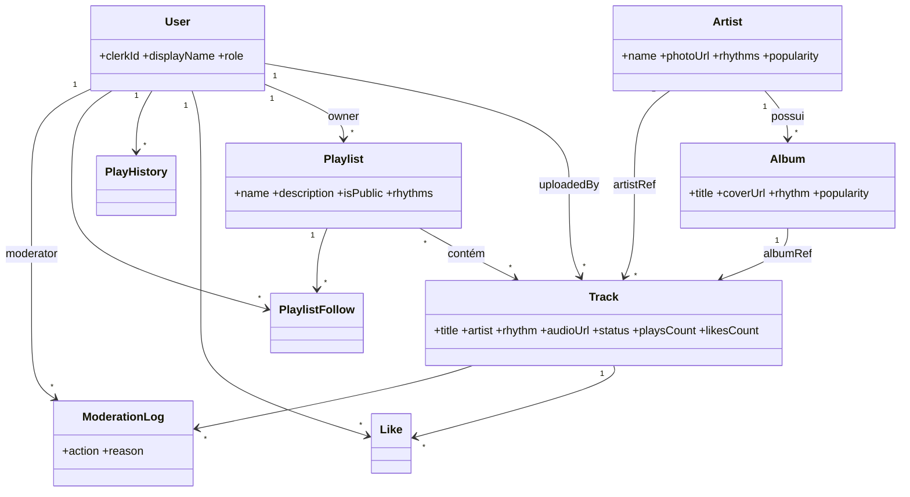

# Botecofy 🍺 — Relatório Final Técnico

> Trabalho Prático de **Engenharia de Software II** — metodologia Scrum, 3 sprints (16/05/2026 a 05/06/2026).
> Este relatório segue a estrutura dos itens 25–45 do edital e explica **o que foi feito e as decisões de projeto** tomadas pela equipe. O detalhamento de cada sprint (planning poker, evidências, retrospectiva) está em [`SPRINTS.md`](SPRINTS.md).

---

## 25. Identificação da equipe
**Equipe: Os Botequeiros**

| Integrante | Papel |
|---|---|
| Maria Luiza Nascimento Morais | Product Owner + Desenvolvimento |
| Alvaro Miguel Rodrigues | Scrum Master + Desenvolvimento |
| Isaac | Desenvolvimento |
| Francisco de Cássio Mourão | Desenvolvimento |

## 26. Tema do sistema
Plataforma de streaming musical com **curadoria humana focada em ritmos de bar**: brega, pagode, sertanejo e arrocha.

## 27. Problema que o sistema resolve
As plataformas genéricas tratam esses ritmos como secundários, guiadas por algoritmo e sem curadoria especializada nem organização por estilo. O **Botecofy** organiza o acervo **por ritmo** e oferece **playlists temáticas curadas por pessoas**, com um player próprio e interação em tempo real — um espaço com a "cara do boteco".

## 28. Visão geral do produto
Acervo classificado por ritmo + curadoria humana + player com fila/estados + interação (curtidas/plays) em tempo real + descoberta por artistas e álbuns. Papéis de **Ouvinte**, **Curador** e **Administrador** governam o que cada um pode fazer.

> **Declaração de visão:** *Para ouvintes e curadores de brega, pagode, sertanejo e arrocha, que não encontram curadoria nem organização por ritmo nas plataformas genéricas, o Botecofy é uma plataforma de streaming que organiza o acervo por ritmo e aposta em curadoria humana — diferentemente das plataformas guiadas só por algoritmo.*

## 29. Atores / perfis de usuário
- **Ouvinte** — descobre, ouve, curte e segue playlists; vê perfil/histórico.
- **Curador** — tudo do ouvinte + cadastra faixas e cria playlists.
- **Administrador** — tudo do curador + modera o acervo (inativar/reativar).

Identidade delegada ao **Clerk**; o `role` é mantido localmente e sincronizado pelo `clerkId` (RN10), resolvido por `publicMetadata.role` ou pela lista `ADMIN_EMAILS`/`CURATOR_EMAILS`.

## 30. Funcionalidades principais
1. Gerenciar acervo musical (cadastro/moderação).
2. Curadoria por ritmo (playlists temáticas).
3. Descoberta e reprodução (busca, filtros, player, álbuns, artistas).
4. Interação social em tempo real (curtidas/plays).
5. Perfil e histórico do usuário.

## 31. Histórias de usuário

| ID | História |
|---|---|
| HU01 | Como **curador**, quero **cadastrar/enviar faixas** (áudio + capa) para alimentar o acervo. |
| HU02 | Como **ouvinte**, quero **buscar e filtrar faixas por ritmo** (e ordenar) para descobrir músicas. |
| HU03 | Como **ouvinte**, quero **reproduzir** uma faixa e ter o **play registrado**. |
| HU04 | Como **curador**, quero **criar e listar playlists** temáticas. |
| HU05 | Como **ouvinte**, quero **curtir faixas** e ver o contador subir **em tempo real**. |
| HU06 | Como **ouvinte**, quero **seguir playlists** para acesso rápido. |
| HU07 | Como **administrador**, quero **moderar o acervo** (inativar/reativar com registro). |
| HU08 | Como **ouvinte**, quero ver meu **perfil e histórico** de reprodução. |
| HU09 | Como **ouvinte**, quero **navegar por artistas e álbuns** e **tocar o álbum inteiro**. |

## 32. Critérios de aceitação
Critérios completos (formato Dado/Quando/Então) em [`SPRINTS.md`](SPRINTS.md), seção 3 da Sprint 1. Exemplos:
- **HU02:** ao filtrar por ritmo, só aparecem faixas desses ritmos; faixas inativas não aparecem (RN04).
- **HU05:** curtir/descurtir é idempotente (RN07) e o contador atualiza ao vivo em outra aba.
- **HU09:** clicar no álbum (ou no play do card) enfileira e toca **todas** as faixas do álbum.

## 33. Backlog e planejamento das sprints
Backlog priorizado por **MoSCoW + Story Points** e dividido em 3 sprints semanais. Resultado: **52 SP** entregues, backlog 100% concluído.

| Sprint | Período | Foco | Histórias |
|---|---|---|---|
| 1 | 16/05–22/05/2026 | Fundação & Planejamento | IT00, IT01 + artefatos |
| 2 | 23/05–29/05/2026 | Acervo & Reprodução | HU01, HU02, HU03 |
| 3 | 30/05–05/06/2026 | Curadoria, Social & Descoberta | HU04–HU09 |

Detalhamento (planning poker, velocity, burndown, retrospectiva) em [`SPRINTS.md`](SPRINTS.md).

## 34. Arquitetura adotada
**Arquitetura em camadas**, em monorepo `client` + `server`.

```
Apresentação (routes / controllers / sockets / middlewares)
        ↓
Aplicação & Domínio (services — regras de negócio)
        ↓
Persistência (repositories / models)
```

**Decisão de projeto:** escolhemos camadas (em vez de tudo no controller) para **manter a regra de negócio isolada nos serviços**, fora da interface HTTP — o que torna o domínio testável sem `req`/`res` e sem banco, e atende ao requisito de não acoplar regra à apresentação. O monorepo com workspaces npm simplifica o setup do time (instalação e execução únicas).

## 35. Framework e linguagem utilizados
**TypeScript** em todo o stack. Back-end: **Express** (framework exigido) + **Mongoose/MongoDB** + **Clerk** + **Socket.io**. Front-end: **React + Vite** + **Tailwind** + **Zustand** + **React Query**.

**Decisões de projeto:**
- **MongoDB** — esquema flexível encaixa no catálogo (faixas/álbuns/artistas) e em contadores desnormalizados (plays/likes) sem migrações rígidas.
- **Clerk** — login real (Google/e-mail) sem reimplementar segurança; papéis via metadata. Abstraímos atrás de `AuthProvider` (DIP) para não acoplar o domínio.
- **Socket.io** — atualização ao vivo de curtidas/plays, com fallback robusto de transporte.
- **Zustand** — estado global enxuto para o player; **React Query** — cache/revalidação dos dados da API.

## 36. Modelo de domínio / diagrama de classes


## 37. Modelo de dados
Coleções MongoDB e principais índices:

| Coleção | Campos-chave | Índices |
|---|---|---|
| `users` | clerkId, displayName, role | `clerkId` único |
| `artists` | name, photoUrl, rhythms, popularity, **photoChecked** | `name` único; `popularity` (ranking) |
| `albums` | title, artist→Artist, coverUrl, rhythm, tracks[]→Track, popularity | `{artist,title}` único; `popularity` |
| `tracks` | title, artist, rhythm, audioUrl, status, playsCount, likesCount, uploadedBy, artistRef, albumRef | `{artist,title}` único **parcial** (só ativas — RN02); índice **textual** (título/artista — HU02) |
| `playlists` | name, owner→User, isPublic, rhythms[], tracks[]→Track | `{owner,name}` |
| `likes` | user→User, track→Track | `{user,track}` único (RN07) |
| `playhistories` | user→User, track→Track, createdAt | por usuário/data |
| `playlistfollows` | user→User, playlist→Playlist | `{user,playlist}` único |
| `moderationlogs` | track→Track, moderator→User, action, reason | por faixa |

**Decisão de projeto:** os contadores (`playsCount`/`likesCount`/`popularity`) são **desnormalizados** e atualizados por `$inc` atômico — escolha por *eventual consistency* em vez de transações multi-documento, priorizando simplicidade e desempenho de leitura nas listagens.

## 38. Princípios de projeto aplicados
| Princípio | Onde |
|---|---|
| Integridade conceitual | enum `Rhythm` único em todas as camadas; nomenclatura `*Service`/`*Repository`/`*Controller` |
| Ocultamento de informação | controllers não conhecem Mongoose; services não conhecem `req`/`res`; acesso a dados atrás de interfaces; DTOs na fronteira HTTP |
| Coesão | cada serviço com responsabilidade única (`TrackService`, `LikeService`, `PlaybackService`, `ArtistService`, `AlbumService`…) |
| Acoplamento | serviços dependem de **interfaces** de repositório, não de implementações |
| Separação de responsabilidades | pastas por finalidade: apresentação, domínio, persistência, validação, erro, configuração |

## 39. Princípios SOLID aplicados (com localização)
| Princípio | Arquivo / classe | Como |
|---|---|---|
| **SRP** | `services/*Service.ts` vs `controllers/*Controller.ts` vs `repositories/*Repository.ts` | Cada um com uma razão para mudar |
| **OCP** | `services/strategies/SortStrategy.ts` | Nova ordenação = nova estratégia, sem alterar `TrackService`/`TrackRepository` |
| **LSP** | `repositories/interfaces.ts` + mocks nos testes | Implementações reais/mockadas substituíveis sem quebrar os serviços |
| **ISP** | `ITrackRepository`, `IPlaylistRepository`, `IAlbumRepository`, `IArtistRepository`… | Interfaces pequenas e específicas por agregado |
| **DIP** | `config/container.ts` | *Composition root* injeta repositórios, `StorageService`, `RealtimeNotifier`, `DeezerService` e `AuthProvider` via abstração |

## 40. Padrões de projeto utilizados
| Padrão | Arquivo | Problema resolvido |
|---|---|---|
| **Repository** | `repositories/*Repository.ts` | Isola o Mongoose; permite testar sem banco |
| **Service Layer** | `services/*Service.ts` | Concentra regras de negócio fora de controller/UI |
| **DTO** | `dtos/mappers.ts` | Não vazar campos internos (`__v`, refs) na API |
| **Strategy** | `services/strategies/SortStrategy.ts` | Trocar critério de ordenação sem modificar o serviço (OCP) |
| **Factory Method** | `services/TrackFactory.ts` | Criar faixa a partir de upload ou URL externa |
| **Observer** | `services/events/RealtimeNotifier.ts` + `sockets/` | Domínio emite eventos sem conhecer Socket.io; sockets observam e retransmitem |
| **State** | `client/src/store/playerStore.ts` | Máquina de estados do player (`idle→loading→playing⇄paused→ended`) |

## 41. Explicação das principais classes / módulos
- `TrackService` — cadastro/busca de faixas; aplica RN01/RN02/RN04/RN08.
- `PlaybackService` — contagem honesta de plays (RN06) + histórico, emitindo evento.
- `LikeService` — curtir/descurtir idempotente (RN07) + evento de tempo real.
- `PlaylistService` — curadoria; RN01/RN03/RN05/RN09 e o "seguir" (HU06).
- `ModerationService` — inativar/reativar com log de auditoria (HU07/RN04).
- `ArtistService` — destaques e perfil do artista; **enriquece a foto via `DeezerService`** sob demanda e persiste (`photoChecked`).
- `AlbumService` — recomendações e **detalhe do álbum com faixas** (tocar o álbum inteiro — HU09).
- `DeezerService` — foto real do artista pela API pública da Deezer (a iTunes não fornece foto de artista; a Last.fm descontinuou as imagens em 2019).
- `RealtimeNotifier` / `sockets` — ponte Observer → Socket.io.
- `LocalStorageService` — implementação concreta do `StorageService` (DIP), pronta para troca por nuvem.
- `playerStore` (front) — máquina de estados do player (padrão State).

## 42. Testes realizados (evidências dos critérios de aceitação)
- **Unitários (Vitest, repositórios mockados):**
  - `TrackService` — RN01 (ritmo inválido), exige título/artista, RN02 (duplicado), criação ativa (HU01).
  - `PlaybackService` — RN06: não conta abaixo do mínimo (mas registra histórico) / conta a partir do mínimo e emite evento (HU03).
  - `LikeService` — RN07 idempotente + Observer (HU05).
- **Integração (Supertest + MongoDB em memória):** `track.routes.test.ts` — HU02 (só ativas, filtro por ritmo), HU01/HU07 (403 ouvinte, 401 sem auth — RN03), RN04.

**Resultado:** `npm test` → **8 testes unitários passando** + **4 de integração = 12 testes** cobrindo as histórias e regras. Saída registrada em [`SPRINTS.md`](SPRINTS.md) (Sprints 2 e 3).

## 43. Dificuldades encontradas
- **Autenticação real sem acoplar o domínio** → interface `AuthProvider` (DIP), com `ClerkAuthProvider` em produção e provedor falso nos testes, mantendo o mesmo `req.actor`.
- **Contadores em tempo real sem transações** → desnormalização + `$inc` atômico + eventos de domínio (Observer).
- **Foto de artista** → a iTunes (fonte do seed) não traz foto de artista e a Last.fm passou a devolver só um placeholder; decisão: usar a **API pública da Deezer** sob demanda, com cache no banco (`photoChecked`) e fallback para a capa do álbum.
- **Tipagem do Mongoose com arrays de refs** → `InferSchemaType` + DTOs na fronteira.

## 44. Melhorias futuras
- Armazenamento de áudio em nuvem (S3/Cloudinary) trocando a implementação do `StorageService`.
- Testes automatizados para `ArtistService`/`AlbumService` (catálogo).
- Cache/CDN próprio para as fotos de artista (hoje dependentes da Deezer).
- "Boteco ao Vivo" (escuta síncrona em sala) reaproveitando a base de Socket.io.
- Recomendação por afinidade de ritmo a partir do `PlayHistory`.

## 45. Link do repositório
https://github.com/malusccp/botecofy-music-player
