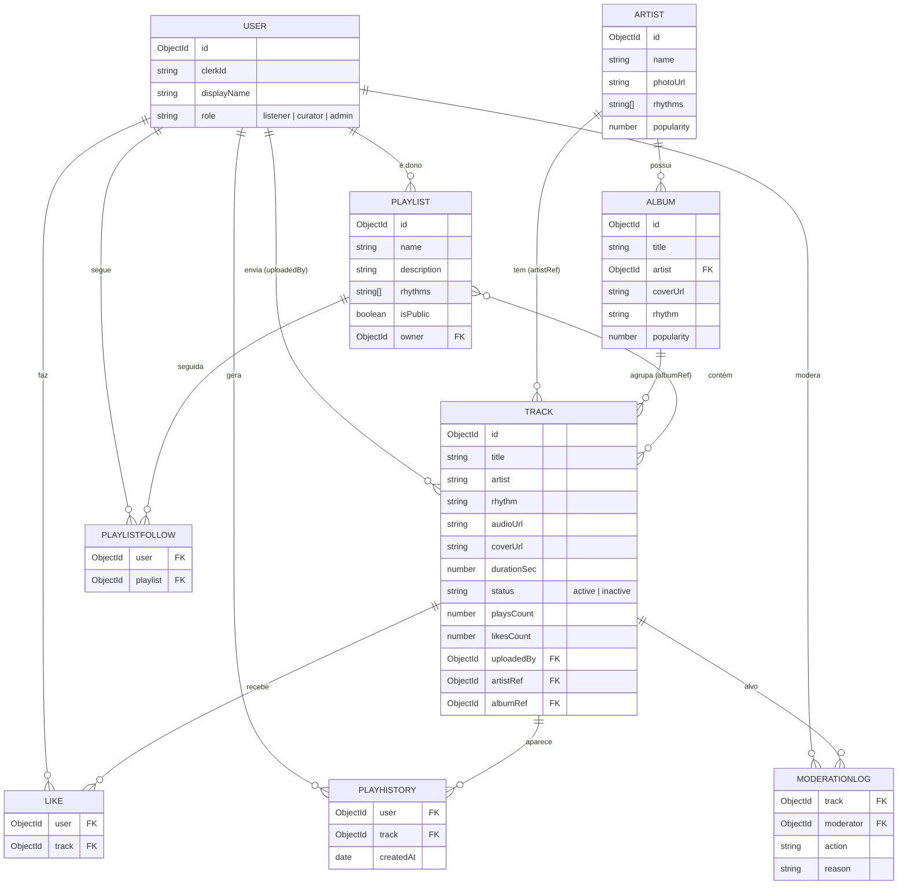

# Botecofy 🍺 — Documentação das Sprints

> Trabalho Prático de **Engenharia de Software II** — metodologia **Scrum**, 3 sprints semanais.
> **Período do projeto:** 16/05/2026 a 05/06/2026.
> **Equipe: Os Botequeiros.**

| Integrante | Papel |
|---|---|
| Maria Luiza Nascimento Morais | Product Owner + Desenvolvimento |
| Alvaro Miguel Rodrigues | Scrum Master + Desenvolvimento |
| Isaac | Desenvolvimento |
| Francisco de Cássio Mourão | Desenvolvimento |

## Visão geral das sprints

| Sprint | Período | Tema / Meta |
|---|---|---|
| **Sprint 1** | 16/05 – 22/05/2026 | **Fundação & Planejamento** — visão, backlog, arquitetura, modelo de dados e esqueleto do projeto |
| **Sprint 2** | 23/05 – 29/05/2026 | **Acervo & Reprodução** — cadastro, busca/filtros por ritmo e player (HU01–HU03) |
| **Sprint 3** | 30/05 – 05/06/2026 | **Curadoria, Social & Descoberta** — playlists, curtidas em tempo real, perfil, moderação, artistas/álbuns (HU04–HU08) |

---

# 🏁 Sprint 1 — Fundação & Planejamento
**Período:** 16/05/2026 a 22/05/2026
**Objetivo da sprint:** alinhar a visão do produto, montar o backlog priorizado, definir e justificar a arquitetura/stack, modelar as entidades principais e entregar o repositório com a estrutura inicial do projeto pronta para o desenvolvimento das próximas sprints.

## 1. Documento de visão do produto

**O quê:** Botecofy é uma plataforma de streaming musical com **curadoria humana focada em ritmos de bar** — brega, pagode, sertanejo e arrocha.

**O problema:** as plataformas genéricas tratam esses ritmos como secundários, sem curadoria especializada nem organização clara por estilo. Quem curte "som de boteco" não encontra um espaço dedicado, com acervo organizado por ritmo e playlists montadas por pessoas que entendem do assunto.

**Declaração de visão (modelo de Geoffrey Moore):**

> **Para** ouvintes e curadores apaixonados por brega, pagode, sertanejo e arrocha,
> **que** não encontram nas plataformas genéricas curadoria nem organização por ritmo,
> **o Botecofy** é uma plataforma de streaming musical
> **que** organiza o acervo por ritmo, oferece playlists temáticas curadas por pessoas e um player próprio com interação em tempo real.
> **Diferentemente** das plataformas genéricas guiadas só por algoritmo,
> **nosso produto** aposta em curadoria humana e em uma experiência com a "cara do boteco".

**Pilares do produto:**
1. **Acervo por ritmo** — todo conteúdo classificado em brega, pagode, sertanejo ou arrocha.
2. **Curadoria humana** — playlists temáticas montadas por curadores, não por recomendação algorítmica.
3. **Player próprio** — reprodução com fila, controles e contagem honesta de execuções.
4. **Interação em tempo real** — curtidas e contadores de plays atualizados ao vivo.
5. **Papéis e moderação** — ouvinte, curador e administrador, com governança do acervo.

**Atores / perfis:**
- **Ouvinte** — descobre, ouve, curte e segue playlists.
- **Curador** — tudo do ouvinte + cadastra faixas e cria playlists.
- **Administrador** — tudo do curador + modera o acervo (inativar/reativar faixas).

## 2. Backlog do produto

Priorização por **MoSCoW** e estimativa em **Story Points** (escala de Fibonacci). HU = História de Usuário; IT = Item Técnico/Habilitador.

| ID | História de usuário | Prioridade | SP | Sprint |
|---|---|---|---|---|
| IT00 | Como time, quero a **estrutura do monorepo** (client/server) e configs base para começar a desenvolver | Must | 5 | 1 |
| IT01 | Como time, quero **autenticação real (Clerk)** e resolução de papéis para proteger as rotas | Must | 5 | 1 |
| HU01 | Como **curador**, quero **cadastrar/enviar faixas** (com áudio e capa) para alimentar o acervo | Must | 8 | 2 |
| HU02 | Como **ouvinte**, quero **buscar e filtrar faixas por ritmo** (e ordenar) para descobrir músicas | Must | 5 | 2 |
| HU03 | Como **ouvinte**, quero **reproduzir uma faixa** e ter o **play registrado** para histórico/ranking | Must | 5 | 2 |
| HU04 | Como **curador**, quero **criar e listar playlists** temáticas para organizar a curadoria | Should | 5 | 3 |
| HU05 | Como **ouvinte**, quero **curtir faixas** e ver o contador subir **em tempo real** | Should | 3 | 3 |
| HU06 | Como **ouvinte**, quero **seguir playlists** para acessá-las rápido na minha biblioteca | Could | 3 | 3 |
| HU07 | Como **administrador**, quero **moderar o acervo** (inativar/reativar com registro) | Should | 5 | 3 |
| HU08 | Como **ouvinte**, quero ver meu **perfil e histórico** de reprodução | Could | 3 | 3 |
| HU09 | Como **ouvinte**, quero **navegar por artistas e álbuns** e **tocar o álbum inteiro** | Could | 5 | 3 |

**Regras de negócio (RN) que atravessam o backlog:**
- **RN01** — só curador/admin cadastra faixa ou cria playlist.
- **RN02** — título de faixa **único por artista** entre faixas ativas.
- **RN03** — ouvinte não acessa rotas de upload/moderação (403).
- **RN04** — faixa inativada **some** da busca pública.
- **RN05** — playlist privada só é vista pelo dono.
- **RN06** — play só conta com tempo mínimo de escuta (contagem honesta).
- **RN07** — curtir é **idempotente** (curtir/descurtir).
- **RN08** — faixa precisa ter áudio válido.
- **RN09** — playlist não aceita faixa duplicada.
- **RN10** — identidade delegada ao Clerk; `role` mantido localmente e sincronizado por `clerkId`.

## 3. Critérios de aceitação

**IT00 — Estrutura do monorepo**
- Dado o repositório clonado, quando rodo `npm install` na raiz, então as dependências de `client` e `server` são instaladas via workspaces.
- Quando rodo `npm run dev`, então API (porta 4000) e front-end (porta 5173) sobem juntos.

**IT01 — Autenticação (Clerk) e papéis**
- Dado um usuário sem token, quando ele chama uma rota protegida, então recebe **401**.
- Dado um ouvinte autenticado, quando chama upload/moderação, então recebe **403** (RN03).
- Dado um e-mail listado em `ADMIN_EMAILS`/`CURATOR_EMAILS`, quando ele faz login, então o papel correspondente é aplicado (RN10).

**HU01 — Cadastrar faixa**
- Dado um curador, quando envia uma faixa com áudio e metadados válidos, então ela é criada e fica disponível.
- Quando o título já existe para o mesmo artista (ativa), então o cadastro é rejeitado (RN02).
- Quando o arquivo de áudio é inválido/ausente, então o cadastro é rejeitado (RN08).

**HU02 — Buscar/filtrar**
- Dado o acervo, quando filtro por um ou mais ritmos, então só aparecem faixas desses ritmos.
- Quando busco por texto, então o resultado considera título e artista.
- Quando uma faixa está inativa, então ela **não** aparece (RN04).

**HU03 — Reproduzir**
- Dada uma faixa, quando clico em tocar, então o player inicia a reprodução.
- Quando atinjo o tempo mínimo de escuta, então o play é registrado uma vez (RN06) e entra no histórico.

**HU04 — Playlists**
- Dado um curador, quando cria uma playlist, então ela aparece na listagem (pública) e na sua biblioteca.
- Quando tento adicionar uma faixa já presente, então a duplicata é impedida (RN09).
- Playlist privada só é visível ao dono (RN05).

**HU05 — Curtir (tempo real)**
- Dada uma faixa, quando curto, então o contador incrementa; quando descurto, decrementa (RN07).
- Quando outro usuário curte, então meu contador atualiza **ao vivo** (sem recarregar).

**HU06 — Seguir playlist**
- Quando sigo uma playlist, então ela aparece em "Sua Biblioteca"; ao deixar de seguir, some.

**HU07 — Moderação**
- Dado um admin, quando inativa uma faixa com motivo, então ela some da busca (RN04) e o ato fica registrado em log.
- O ouvinte/curador comum não acessa a moderação (RN03).

**HU08 — Perfil e histórico**
- Dado um usuário autenticado, quando abro o perfil, então vejo meus dados, playlists seguidas e o histórico recente de reprodução.

**HU09 — Artistas e álbuns**
- Quando abro um artista, então vejo foto, álbuns e faixas mais populares dele.
- Quando clico em um álbum (ou no play do card), então **todas as faixas** do álbum entram na fila e tocam.

## 4. Planejamento das 3 sprints

| Sprint | Período | Itens | Meta da sprint |
|---|---|---|---|
| **Sprint 1** | 16/05 – 22/05/2026 | IT00, IT01 + artefatos de planejamento | Fundação: visão, backlog, arquitetura, modelo de dados e esqueleto do projeto rodando com login real |
| **Sprint 2** | 23/05 – 29/05/2026 | HU01, HU02, HU03 | Acervo navegável e tocável: cadastro de faixas, busca/filtros por ritmo e player com registro de play |
| **Sprint 3** | 30/05 – 05/06/2026 | HU04, HU05, HU06, HU07, HU08, HU09 | Curadoria + social + descoberta: playlists, curtidas em tempo real, seguir, moderação, perfil/histórico e catálogo de artistas/álbuns |

**Capacidade e cerimônias:** sprints de 1 semana, com *Sprint Planning* na segunda, *Daily* assíncrona pelo grupo, e *Review* + *Retrospective* na sexta. Total estimado: ~50 Story Points distribuídos nas 3 sprints.

## 5. Justificativa da arquitetura e do framework

**Arquitetura: em camadas, em um monorepo `client` + `server`.**

```
Apresentação (routes / controllers / sockets / middlewares)
        ↓
Aplicação & Domínio (services — onde ficam as regras de negócio)
        ↓
Persistência (repositories / models)
```

- **Por que em camadas?** Mantém a **regra de negócio isolada nos serviços**, fora da interface HTTP, facilitando teste e manutenção. Atende ao requisito de não misturar regra com camada de apresentação.
- **Por que monorepo?** Front-end e back-end versionados juntos, com instalação única (workspaces), simplificando o setup do time.
- **Padrões previstos:** Repository, Service Layer, DTO, Strategy (ordenação), Factory Method (criação de faixa), Observer (eventos em tempo real) e State (máquina de estados do player) — escolhidos para resolver problemas concretos e sustentar os princípios SOLID.

**Stack e justificativa:**

| Camada | Tecnologia | Por quê |
|---|---|---|
| Linguagem | **TypeScript** (todo o stack) | Tipagem estática reduz erros e documenta os contratos |
| Back-end | **Express** | Framework web maduro e exigido no trabalho; minimalista e flexível |
| Banco | **MongoDB + Mongoose** | Esquema flexível encaixa bem no catálogo (faixas/álbuns/artistas) e em contadores desnormalizados |
| Autenticação | **Clerk** | Login real (Google/e-mail) sem reimplementar segurança; papéis via metadata |
| Tempo real | **Socket.io** | Atualização ao vivo de curtidas/plays com fallback robusto |
| Front-end | **React + Vite** | SPA rápida; Vite dá HMR ágil no desenvolvimento |
| Estilo | **Tailwind CSS** | Prototipagem rápida e identidade visual consistente |
| Estado | **Zustand** | Estado global simples para o player (fila/índice/status) |
| Dados remotos | **React Query** | Cache, revalidação e estados de carregamento da API |

## 6. Modelo das principais entidades

Diagrama entidade-relacionamento (renderiza no GitHub via Mermaid):



**Resumo das entidades:**
- **User** — identidade (via Clerk) e papel (`listener`/`curator`/`admin`).
- **Artist** — artista do acervo (nome, foto, ritmos, popularidade).
- **Album** — álbum de um artista, com capa e ritmo; agrupa faixas.
- **Track** — faixa: áudio, capa, ritmo, status e contadores; referencia opcionalmente artista/álbum.
- **Playlist** — coleção curada de faixas, pública ou privada.
- **Like / PlayHistory / PlaylistFollow** — interações do usuário (curtir, histórico, seguir).
- **ModerationLog** — trilha de auditoria das ações de moderação.

## 7. Repositório inicial — estrutura do projeto

Monorepo com workspaces npm. Estrutura entregue ao fim da Sprint 1:

```
botecofy/
├── client/                 # React + Vite + TypeScript + Tailwind
│   ├── public/             # assets estáticos (logo, fontes)
│   └── src/
│       ├── components/     # UI reutilizável (cards, navbar, player…)
│       ├── features/       # páginas (Descobrir, Playlists, Perfil…)
│       ├── store/          # estado global (player — Zustand)
│       ├── lib/            # api (axios) e queries (React Query)
│       ├── auth/           # integração Clerk no front
│       └── types/          # contratos de dados compartilhados
├── server/                 # Node + Express + Mongoose + Clerk + Socket.io
│   └── src/
│       ├── routes/         # apresentação (rotas HTTP)
│       ├── controllers/    # apresentação (orquestram req/res)
│       ├── services/       # regras de negócio
│       ├── repositories/   # acesso a dados (padrão Repository)
│       ├── models/         # schemas Mongoose
│       ├── dtos/           # mapeadores de saída (DTO)
│       ├── middlewares/    # auth, erros
│       ├── config/         # env, db, container (injeção de dependência)
│       └── seed/           # carga inicial do acervo
├── docs/                   # planejamento, sprints e relatórios
├── package.json            # workspaces + scripts (dev, seed, test, build)
└── README.md
```

**Scripts disponíveis na raiz:**

| Comando | Função |
|---|---|
| `npm install` | Instala client + server (workspaces) |
| `npm run dev` | Sobe API (4000) e front (5173) juntos |
| `npm run seed` | Popula o banco com o acervo inicial |
| `npm test` | Testes do servidor (Vitest) |
| `npm run build` | Build de produção |

## 8. Repositório Git e quadro Trello

- 🔗 **Repositório Git:** https://github.com/malusccp/botecofy-music-player
- 🔗 **Quadro Trello:** _<inserir o link do quadro aqui>_

**Organização do quadro Trello (Scrum board):**

| Lista | Conteúdo |
|---|---|
| 📥 **Product Backlog** | Todas as histórias (HU01–HU09) e itens técnicos (IT00, IT01), priorizadas por MoSCoW |
| 🎯 **Sprint Backlog (atual)** | Itens selecionados para a sprint vigente |
| 🛠️ **Doing** | Em desenvolvimento (com responsável) |
| 👀 **Review/Test** | Em revisão ou teste |
| ✅ **Done** | Concluído e aceito (critérios de aceitação atendidos) |

Cada card traz: descrição da história, **critérios de aceitação** (checklist), Story Points (label), prioridade MoSCoW (label) e responsável. As etiquetas de ritmo/área e a data de entrega acompanham o item ao longo do fluxo.

---

---

# 🎵 Sprint 2 — Acervo & Reprodução
**Período:** 23/05/2026 a 29/05/2026
**Itens da sprint:** HU01 (cadastrar faixa), HU02 (buscar/filtrar), HU03 (reproduzir/registrar play).
**Objetivo da sprint:** transformar a fundação da Sprint 1 em um acervo **navegável e tocável** — curador cadastra faixas, ouvinte busca/filtra por ritmo e reproduz com o player próprio registrando os plays.

## 1. Incremento funcional do sistema

Ao fim da Sprint 2 o sistema entrega um fluxo ponta a ponta de acervo:

- **Cadastro de faixas (HU01):** tela "Enviar faixa" + `POST /api/tracks` com upload de áudio (multipart), validação de metadados, capa e gravação do arquivo via `StorageService`. Restrito a curador/admin.
- **Busca e filtros (HU02):** `GET /api/tracks` com filtro por um ou mais ritmos, busca textual (título/artista), ordenação (recentes/mais tocadas/mais curtidas) e paginação. A tela "Descobrir" consome isso com chips de ritmo e campo de busca.
- **Reprodução (HU03):** player próprio com **fila e máquina de estados** (`idle→loading→playing⇄paused→ended`); ao atingir o tempo mínimo de escuta, o play é registrado (`POST /api/tracks/:id/play`) e entra no histórico, com o contador atualizado.
- **Carga inicial do acervo:** `npm run seed` popula faixas reais (iTunes Search API) por ritmo, dando massa de dados para a busca e o player.

## 2. Código versionado

Incremento versionado no Git (branch `main`), com **commits convencionais** e integração por *merge* das frentes:

| História | Commit | Mensagem |
|---|---|---|
| HU01 | `db8d9d7` | feat: cadastrar faixa com upload e validacao (HU01) |
| HU02 | `bb22dbe` | feat: buscar e filtrar acervo por ritmo (HU02) |
| HU03 | `b273c7b` | feat: player com fila e maquina de estados (HU03) |
| Testes | `b46e30d` | test: adicionar testes de TrackService e rotas de faixa |
| Integração | `8bbb463` | merge: integrar acervo, descoberta e perfil |

🔗 Repositório: https://github.com/malusccp/botecofy-music-player

## 3. Planning Poker das histórias da Sprint

Estimativa em **Story Points** (Fibonacci) com as cartas de cada integrante. Quando houve divergência, a história foi discutida e revotada até o consenso.

**HU01 — Cadastrar faixa (upload + validação)**

| Rodada | Maria Luiza | Alvaro | Isaac | Cássio | Resultado |
|---|---|---|---|---|---|
| 1ª | 8 | 13 | 5 | 8 | **Sem consenso** — Alvaro destacou upload de arquivo + storage + RN02 (título único); Isaac achava que a validação era simples |
| 2ª | 8 | 8 | 8 | 8 | ✅ **Consenso: 8 SP** |

**HU02 — Buscar e filtrar por ritmo**

| Rodada | Maria Luiza | Alvaro | Isaac | Cássio | Resultado |
|---|---|---|---|---|---|
| 1ª | 5 | 5 | 3 | 5 | Quase consenso — Isaac reconsiderou por causa do índice textual e da paginação |
| 2ª | 5 | 5 | 5 | 5 | ✅ **Consenso: 5 SP** |

**HU03 — Reproduzir e registrar play**

| Rodada | Maria Luiza | Alvaro | Isaac | Cássio | Resultado |
|---|---|---|---|---|---|
| 1ª | 5 | 8 | 5 | 3 | **Sem consenso** — Alvaro citou a máquina de estados do player + evento de tempo real; Cássio só via o registro do play |
| 2ª | 5 | 5 | 5 | 5 | ✅ **Consenso: 5 SP** |

**Total da Sprint 2:** 18 Story Points.

## 4. Regras de negócio implementadas

| RN | Descrição | Onde (arquivo) | Como |
|---|---|---|---|
| **RN01** | Só curador/admin cadastra faixa | `middlewares/` (guarda de papel) + rota `POST /tracks` | Middleware de autorização barra ouvinte antes do controller |
| **RN02** | Título **único por artista** entre faixas ativas | `models/Track.ts` + `services/TrackService.ts` | Índice único parcial (`{artist, title}` com `status: active`) + verificação no serviço |
| **RN03** | Ouvinte não acessa upload (403) e sem token → 401 | `middlewares/` + `routes/track.routes.ts` | Cadeia de autenticação/autorização |
| **RN04** | Faixa inativa some da busca | `repositories/TrackRepository.ts` (`search`) | Filtro `status: active` por padrão na consulta |
| **RN06** | Play só conta com tempo mínimo de escuta | `services/PlaybackService.ts` | Compara `listenedSeconds` com o mínimo antes do `$inc` |
| **RN08** | Faixa precisa de áudio válido | `services/TrackService.ts` / `TrackFactory.ts` | Criação exige `audioUrl`; seed descarta itens sem preview |

## 5. Princípios SOLID aplicados (onde e como)

| Princípio | Onde | Como foi aplicado |
|---|---|---|
| **SRP** (Responsabilidade Única) | `TrackService` vs `TrackController` vs `TrackRepository` | Controller só traduz HTTP, serviço guarda a regra, repositório só acessa dados — cada um com uma razão para mudar |
| **OCP** (Aberto/Fechado) | `services/strategies/SortStrategy.ts` | Nova ordenação = nova `SortStrategy`, sem alterar `TrackService`/`TrackRepository` |
| **LSP** (Substituição de Liskov) | `repositories/interfaces.ts` + mocks de teste | Repositórios reais e mockados são intercambiáveis sem quebrar os serviços (ver `TrackService.test.ts`) |
| **ISP** (Segregação de Interface) | `ITrackRepository` | Interface pequena e específica do agregado de faixas, em vez de uma interface "gorda" |
| **DIP** (Inversão de Dependência) | `config/container.ts` | O *composition root* injeta repositórios e `StorageService` nos serviços via abstração; o domínio não conhece Mongoose nem o disco |

## 6. Padrões de projeto utilizados

| Padrão | Arquivo | Problema que resolve |
|---|---|---|
| **Repository** | `repositories/TrackRepository.ts` | Isola o acesso ao Mongoose; permite testar serviços sem banco real |
| **Service Layer** | `services/TrackService.ts`, `PlaybackService.ts` | Concentra as regras de negócio fora do controller/UI |
| **DTO** | `dtos/mappers.ts` | Evita vazar campos internos (`__v`, refs) na resposta da API |
| **Strategy** | `services/strategies/SortStrategy.ts` | Troca o critério de ordenação sem modificar o serviço (sustenta o OCP) |
| **Factory Method** | `services/TrackFactory.ts` | Cria a faixa a partir de upload ou de URL externa, centralizando a montagem |
| **Observer** | `services/events/RealtimeNotifier.ts` + `sockets/` | O domínio emite `track:played` sem conhecer o Socket.io; os sockets observam e retransmitem |
| **State** | `client/src/store/playerStore.ts` | Máquina de estados do player (`idle→loading→playing⇄paused→ended`) |

## 7. Evidências de testes

**Comando:** `npm test` (Vitest no servidor). Saída dos testes unitários (repositórios mockados):

```
 ✓ src/services/LikeService.test.ts (2 tests)
 ✓ src/services/PlaybackService.test.ts (2 tests)
 ✓ src/services/TrackService.test.ts (4 tests)

 Test Files  3 passed (3)
      Tests  8 passed (8)
```

**Casos cobertos nesta sprint:**

| Arquivo | Caso de teste | História / RN |
|---|---|---|
| `TrackService.test.ts` | RN01: rejeita ritmo inválido | HU01 / RN01 |
| `TrackService.test.ts` | exige título e artista | HU01 |
| `TrackService.test.ts` | RN02: rejeita título duplicado por artista | HU01 / RN02 |
| `TrackService.test.ts` | cria a faixa com status ativo quando válida | HU01 |
| `PlaybackService.test.ts` | NÃO conta play abaixo do mínimo, mas registra histórico | HU03 / RN06 |
| `PlaybackService.test.ts` | conta play a partir do mínimo e emite evento | HU03 / RN06 |
| `track.routes.test.ts` (integração) | lista apenas faixas ativas | HU02 / RN04 |
| `track.routes.test.ts` (integração) | filtra por ritmo | HU02 |
| `track.routes.test.ts` (integração) | proíbe ouvinte de cadastrar faixa (403) | HU01 / RN03 |
| `track.routes.test.ts` (integração) | exige autenticação (401) | HU01 / RN03 |

Os testes de integração usam **Supertest + MongoDB em memória**. Total: **8 unitários + 4 de integração = 12 testes** cobrindo as histórias e regras da sprint.

## 8. Atualização do backlog (situação das histórias)

| ID | História | SP | Sprint | Situação |
|---|---|---|---|---|
| IT00 | Estrutura do monorepo | 5 | 1 | ✅ Concluída |
| IT01 | Autenticação (Clerk) + papéis | 5 | 1 | ✅ Concluída |
| HU01 | Cadastrar/enviar faixa | 8 | 2 | ✅ Concluída |
| HU02 | Buscar/filtrar por ritmo | 5 | 2 | ✅ Concluída |
| HU03 | Reproduzir + registrar play | 5 | 2 | ✅ Concluída |
| HU04 | Criar/listar playlists | 5 | 3 | ⬜ A fazer |
| HU05 | Curtir (tempo real) | 3 | 3 | ⬜ A fazer |
| HU06 | Seguir playlist | 3 | 3 | ⬜ A fazer |
| HU07 | Moderar acervo | 5 | 3 | ⬜ A fazer |
| HU08 | Perfil e histórico | 3 | 3 | ⬜ A fazer |
| HU09 | Artistas e álbuns + tocar álbum | 5 | 3 | ⬜ A fazer |

**Velocity da Sprint 2:** 18 SP concluídos. **Burndown:** todas as histórias planejadas (HU01–HU03) entregues dentro da semana.

---

---

# 🎉 Sprint 3 — Curadoria, Social & Descoberta (Entrega Final)
**Período:** 30/05/2026 a 05/06/2026
**Itens da sprint:** HU04 (playlists), HU05 (curtir em tempo real), HU06 (seguir playlist), HU07 (moderação), HU08 (perfil/histórico), HU09 (artistas e álbuns + tocar álbum).
**Objetivo da sprint:** fechar o produto com curadoria (playlists), interação social em tempo real, governança do acervo (moderação), perfil do usuário e a camada de descoberta por artistas/álbuns — entregando o **sistema final executável**.

## Planning Poker das histórias da Sprint

| História | Maria Luiza | Alvaro | Isaac | Cássio | Consenso |
|---|---|---|---|---|---|
| HU04 — Criar/listar playlists | 5 | 5 | 8→5 | 5 | **5 SP** (após discutir RN05/RN09) |
| HU05 — Curtir em tempo real | 3 | 5→3 | 3 | 3 | **3 SP** (Observer já existia da base de sockets) |
| HU06 — Seguir playlist | 3 | 3 | 3 | 3 | **3 SP** (consenso na 1ª rodada) |
| HU07 — Moderar acervo | 5 | 5 | 5 | 8→5 | **5 SP** (log de auditoria + RN04) |
| HU08 — Perfil e histórico | 3 | 3 | 5→3 | 3 | **3 SP** |
| HU09 — Artistas/álbuns + tocar álbum | 5 | 8→5 | 5 | 5 | **5 SP** (catálogo + fotos via Deezer) |

**Total da Sprint 3:** 24 Story Points.

---

## Entregáveis da Sprint 3 (Entrega Final)

### 1. Sistema final executável
Produto completo rodando localmente com `npm run dev` (API em `:4000` + front em `:5173`). Fluxo ponta a ponta: login real (Clerk) → descobrir/buscar/filtrar → tocar faixa, álbum ou playlist → curtir em tempo real → criar/seguir playlists → perfil/histórico → moderação (admin). Passo a passo no [README](../README.md).

### 2. Relatório final
Relatório técnico completo (estrutura dos itens 25–45 do edital, com as **decisões de projeto** explicadas) em [`RELATORIO_FINAL.md`](RELATORIO_FINAL.md) — versão em PDF gerada a partir desse arquivo.

### 3. Código-fonte versionado
Branch `main`, commits convencionais. Principais commits da sprint:

| História | Commit | Mensagem |
|---|---|---|
| HU04 | `e845e78` | feat: playlists tematicas por ritmo (HU04) |
| HU05 | `921ed29` | feat: curtir com atualizacao em tempo real (HU05) |
| HU06/HU07 | `6f9dab7` | feat: seguir playlist e moderacao do acervo (HU06, HU07) |
| HU08 | `01f7e02` | feat: perfil sincronizado e historico (HU08) |
| HU09 | `8982574` | feat(catalogo): artistas e albuns com faixas e fotos via Deezer |
| HU09 | `d72547b` | feat(descobrir): cards padronizados, albuns tocaveis e novas secoes |

🔗 https://github.com/malusccp/botecofy-music-player

### 4. Instruções de instalação e execução
Documentadas no [README](../README.md): pré-requisitos (Node 20+, MongoDB), `npm install`, configuração dos `.env` (Clerk), `npm run seed` e `npm run dev`. Resumo:

```bash
npm install
cp server/.env.example server/.env   # preencher chaves do Clerk
cp client/.env.example client/.env
npm run seed
npm run dev
```

### 5. Evidências de testes

**Comando:** `npm test`. Testes unitários (repositórios mockados):

```
 ✓ src/services/LikeService.test.ts (2 tests)
 ✓ src/services/PlaybackService.test.ts (2 tests)
 ✓ src/services/TrackService.test.ts (4 tests)

 Test Files  3 passed (3)
      Tests  8 passed (8)
```

Cobertura ligada aos **critérios de aceitação** desta sprint:

| Arquivo | Caso | História / RN |
|---|---|---|
| `LikeService.test.ts` | curtir/descurtir é idempotente + emite evento (Observer) | HU05 / RN07 |
| `track.routes.test.ts` (integração) | inativa some da busca | HU07 / RN04 |
| `track.routes.test.ts` (integração) | proíbe ouvinte em rota protegida (403) / sem auth (401) | HU07 / RN03 |

Total do projeto: **8 unitários + 4 de integração (Supertest + MongoDB em memória) = 12 testes**. Detalhes por critério no [relatório final](RELATORIO_FINAL.md) (item 42).

### 6. Apresentação final
Roteiro e slides em [`APRESENTACAO.md`](APRESENTACAO.md): visão, arquitetura, demo guiada (HU01–HU09), SOLID/padrões e resultados.

### 7. Retrospectiva final da equipe

**Visão geral das 3 sprints:**

| Sprint | SP planejados | SP entregues | Resultado |
|---|---|---|---|
| 1 — Fundação | 10 | 10 | Planejamento + esqueleto + login real ✅ |
| 2 — Acervo & Reprodução | 18 | 18 | HU01–HU03 ✅ |
| 3 — Curadoria/Social/Descoberta | 24 | 24 | HU04–HU09 ✅ |

**Retrospectiva (formato Manter / Melhorar / Ações):**

| 👍 Manter | 🔧 Melhorar | ✅ Ações para o futuro |
|---|---|---|
| Arquitetura em camadas facilitou dividir o trabalho em paralelo | Testes de integração dependem de baixar o MongoDB em memória (lento em algumas máquinas) | Cachear o binário do mongodb-memory-server / pipeline de CI |
| Commits convencionais + merges por frente deixaram o histórico legível | Pouca cobertura de testes no catálogo (artistas/álbuns) | Adicionar testes para `ArtistService`/`AlbumService` |
| Padrões (Repository/Service/Strategy/Observer) renderam código testável | Fotos de artista dependem de API externa (Deezer) | Avaliar cache/CDN próprio para as imagens |
| Clerk economizou tempo na autenticação | Estimativas iniciais divergiram em histórias com tempo real | Refinar planning poker com mais contexto técnico antes de votar |

**Lições aprendidas:** investir na fundação (Sprint 1) acelerou as sprints seguintes; isolar regra de negócio nos serviços tornou os testes simples; e delegar autenticação/áudio a serviços externos (Clerk/iTunes/Deezer) deixou o time focado no domínio.

## Backlog final (situação de todas as histórias)

| ID | História | SP | Sprint | Situação |
|---|---|---|---|---|
| IT00 | Estrutura do monorepo | 5 | 1 | ✅ Concluída |
| IT01 | Autenticação (Clerk) + papéis | 5 | 1 | ✅ Concluída |
| HU01 | Cadastrar/enviar faixa | 8 | 2 | ✅ Concluída |
| HU02 | Buscar/filtrar por ritmo | 5 | 2 | ✅ Concluída |
| HU03 | Reproduzir + registrar play | 5 | 2 | ✅ Concluída |
| HU04 | Criar/listar playlists | 5 | 3 | ✅ Concluída |
| HU05 | Curtir (tempo real) | 3 | 3 | ✅ Concluída |
| HU06 | Seguir playlist | 3 | 3 | ✅ Concluída |
| HU07 | Moderar acervo | 5 | 3 | ✅ Concluída |
| HU08 | Perfil e histórico | 3 | 3 | ✅ Concluída |
| HU09 | Artistas/álbuns + tocar álbum | 5 | 3 | ✅ Concluída |

**Resultado final:** 11 itens concluídos, **52 Story Points** entregues nas 3 sprints. Backlog 100% concluído.
